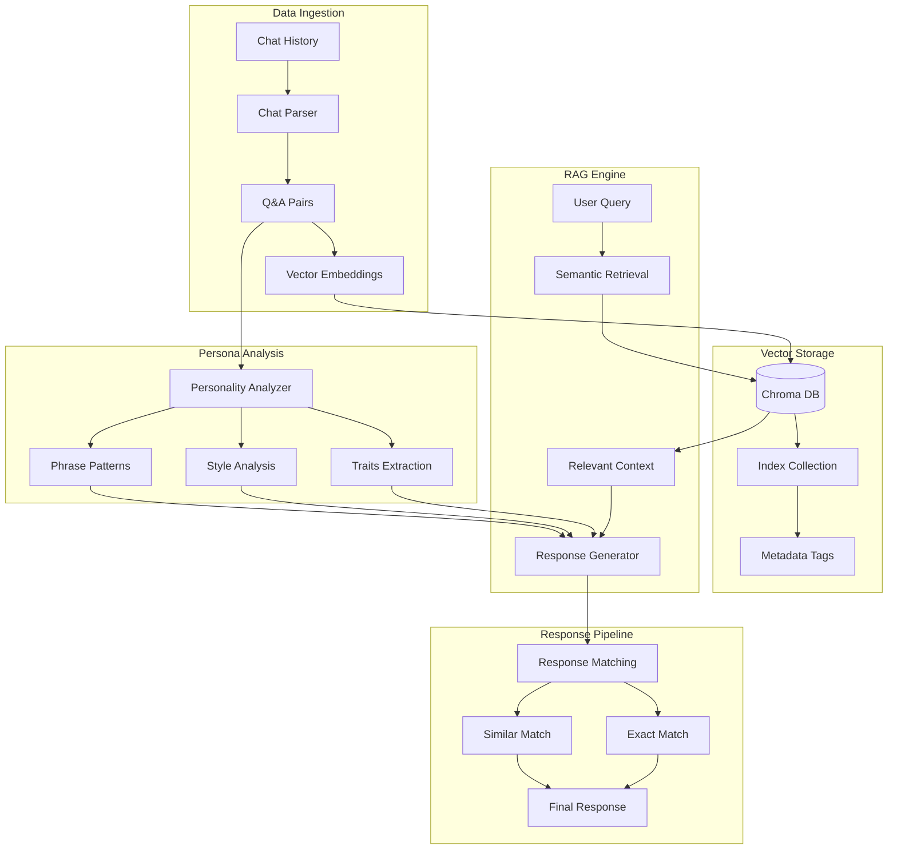

# Open_Source_AI_Hackathon

## System Architecture

## To run
### 1. Save your chat data in human_chat.txt
### 2. Install requirements:
 pip install gradio langchain chromadb tiktoken
### 3. Set your OpenAI API key:

 export OPENAI_API_KEY="your-api-key"
### 4. Run the chatbot:

 python persona_chatbot.py