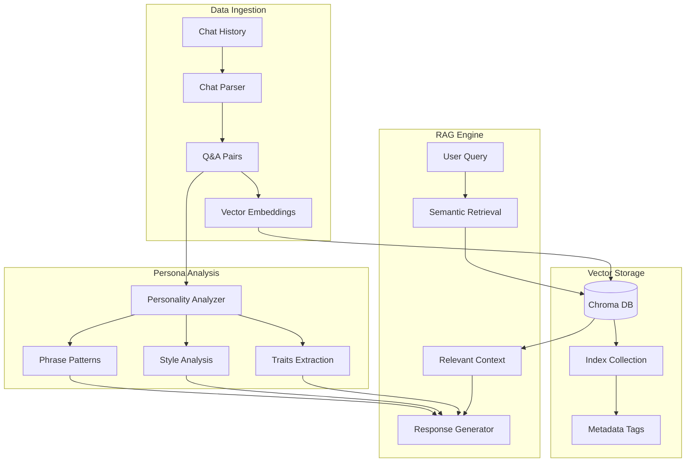

# RAG-based Persona Chatbot 🤖

> A Retrieval-Augmented Generation system that learns and mimics personal communication styles from chat history.

## 🏗 System Architecture



## ✨ Features
    
🧠 Intelligent Persona Analysis

- Extracts personality traits
- Learns communication style
- Identifies common phrases
- Maps topic interests

🎯 Context-Aware Responses

- RAG-powered generation
- Historical context matching
- Style-consistent replies
- Exact response matching

## 🚀 Quick Start
Prerequisites
```
python -m venv venv
.\venv\Scripts\activate
pip install -r requirements.txt
```

Setup
1. Set OpenAI API key
```
set OPENAI_API_KEY=your-api-key
```

2. Run application
```
python app.py
```
3. Access interface

- Open browser to http://localhost:5000
- Upload chat history file
- Start conversation
